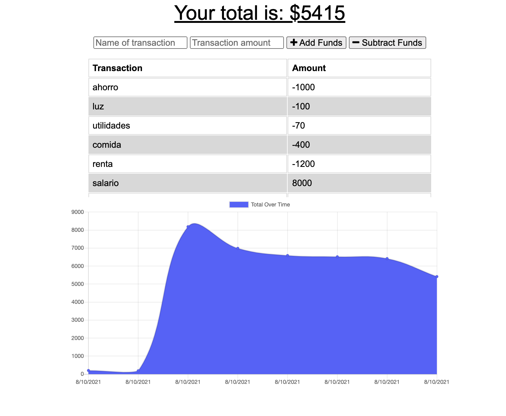

# 19 - PWA: Online/Offline  Budget Tracker

## Project

The project consists on creating the offline access funtionality to a Workout Tracker. The user will be able to add expenses and deposits to their budget with or without a connection. When entering transactions offline, they should populate the total when brought back online.

- - -

- [UserStory](#UserStory)
- [AcceptanceCriteria](#AcceptanceCriteria)
- [Screenshots](#Screenshots&Test)
- [Demo](#Demo)

- - -

## User Story

* AS AN avid traveller 
I WANT to be able to track my withdrawals and deposits with or without a data/internet connection 
SO THAT my account balance is accurate when I am traveling

- - -

## Acceptance Criteria

GIVEN a user is on Budget App without an internet connection
WHEN the user inputs a withdrawal or deposit
THEN that will be shown on the page, and added to their transaction history when their connection is back online.

- - -

## Screenshots 

The following images show the application appearance:

- - -

## Demo URL 

You can find the app deployed on the following link  
<a href="https://pacific-escarpment-19734.herokuapp.com/" target="_blank">Heroku deployed app</a>

- - -

## Used Frameworks/Technologies

- Node.js
- MongoDB
- Mongoose
- JavaScript

- - -
### Contributor

Nicolas Cedano Avena
- - -
© 2021 Trilogy Education Services, LLC, a 2U, Inc. brand. Confidential and Proprietary. All Rights Reserved